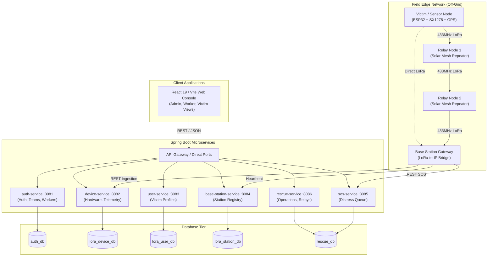

# ResQMesh — Comprehensive System Architecture

ResQMesh is an integrated IoT edge-to-cloud emergency disaster communication platform designed to maintain situational awareness and life-saving rescue coordination when conventional cellular networks and internet backbones fail.

---

## 1. High-Level System Architecture

---

## 2. LoRa Mesh Communication Protocol

- **Frequency**: `433.0 MHz`
- **Modulation**: LoRa Chirp Spread Spectrum (CSS)
- **Spreading Factor (SF)**: 7–12 (default: 7 for speed, 12 for extreme penetration)
- **Bandwidth**: 125 kHz
- **Coding Rate**: 4/5
- **Packet Structure**:
  - `Header`: 8-byte preamble + sync word (`0x12`)
  - `Node ID`: 8-byte ASCII unique hardware identifier
  - `Message Type`: `SOS` | `TELEMETRY` | `HEARTBEAT` | `ACK`
  - `Payload`: JSON or compacted binary telemetry data
  - `Routing Trail`: Array of relay node identifiers traversed
  - `Checksum`: 16-bit CRC hardware verification

---

## 3. Microservice Roles and Port Mapping

| Service | Port | Database | Primary Responsibility |
| :--- | :--- | :--- | :--- |
| `auth-service` | `8081` | `auth_db` | User accounts, JWT auth, OTP email verification, teams, workers |
| `device-service` | `8082` | `lora_device_db` | Hardware beacon management, sensor telemetry ingestion |
| `user-service` | `8083` | `lora_user_db` | Survivor personal profiles, medical history, emergency contacts |
| `base-station-service` | `8084` | `lora_station_db` | Gateway tower registry, geographical coordinates, nearest-station queries |
| `sos-service` | `8085` | `rescue_db` | Real-time intake and queuing of SOS distress alerts |
| `rescue-service` | `8086` | `rescue_db` | Command dashboard aggregator, field team dispatch, relay monitoring |

---

## 4. Disaster Resilience & Failover

1. **Local Offline Mesh**: If all internet connectivity is severed, victim nodes and relay nodes continue communicating with field base stations locally.
2. **Autonomous Microservices**: Microservices use separate MySQL databases; if one service experiences issues, the remaining services continue to operate independently.
3. **Database Independence**: Database failure in `auth_db` does not prevent `rescue-service` and `sos-service` from receiving distress signals and recording rescue telemetry.
