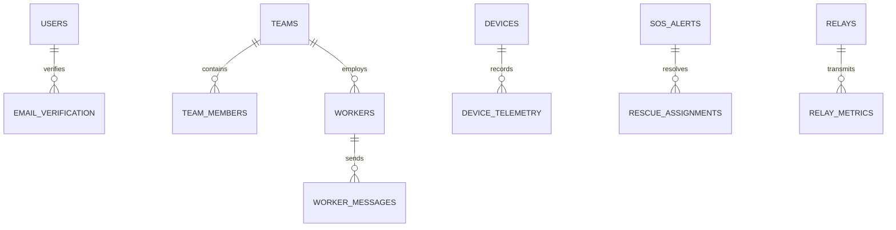

# ResQMesh — Database Design & Schema Architecture

ResQMesh enforces complete isolation between microservice data stores to adhere to microservice domain-driven design principles.

---

## 1. Entity-Relationship (ER) Architecture

---

## 2. Databases & Schemas

### `auth_db`
- `users`: `id`, `name`, `email`, `password`, `role` (`ADMIN`, `WORKER`, `USER`), `phone_number`, `created_at`
- `email_verification`: `id`, `email`, `otp`, `expiry_time`, `verified`
- `teams`: `id`, `team_name`, `team_lead_name`, `specialization`, `contact_number`, `status`
- `workers`: `id`, `worker_name`, `email`, `password`, `team_id`, `role`, `status`

### `lora_device_db`
- `devices`: `id`, `device_id`, `device_type`, `owner_email`, `mac_address`, `status`, `last_ping`
- `device_telemetry`: `id`, `node_id`, `temperature`, `humidity`, `pressure`, `gas_level`, `water_level`, `latitude`, `longitude`, `battery_percent`, `recorded_at`

### `lora_user_db`
- `user_profile`: `id`, `email`, `full_name`, `phone_number`, `blood_group`, `emergency_contact`, `address`, `medical_conditions`, `updated_at`

### `lora_station_db`
- `base_stations`: `id`, `station_code`, `station_name`, `latitude`, `longitude`, `coverage_radius_km`, `status`, `last_heartbeat`

### `rescue_db`
- `sos_alerts`: `id`, `device_id`, `user_email`, `latitude`, `longitude`, `emergency_type`, `severity`, `status` (`PENDING`, `ACCEPTED`, `IN_PROGRESS`, `RESOLVED`), `created_at`
- `rescue_assignments`: `id`, `sos_id`, `team_id`, `assigned_worker_email`, `status`, `assigned_at`, `resolved_at`
- `relays`: `id`, `relay_code`, `latitude`, `longitude`, `battery_percentage`, `solar_charging`, `signal_strength`, `status`
- `worker_messages`: `id`, `sender_email`, `receiver_email`, `team_id`, `message_text`, `timestamp`
